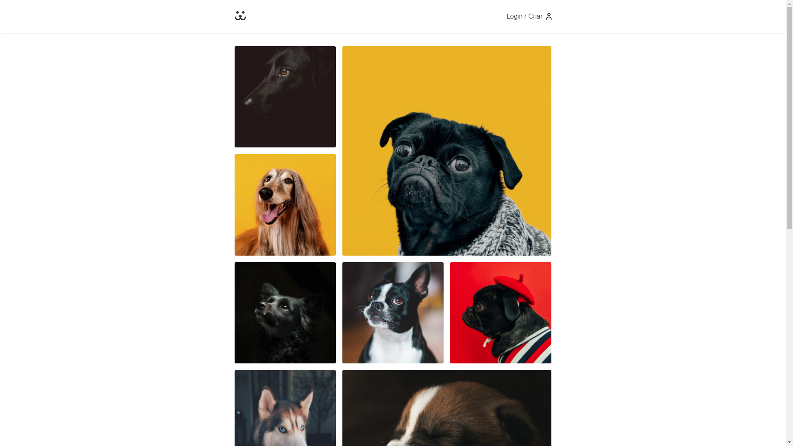
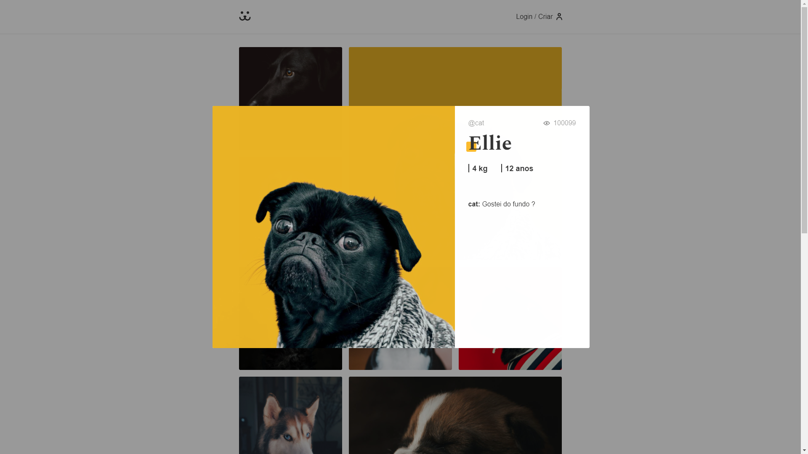
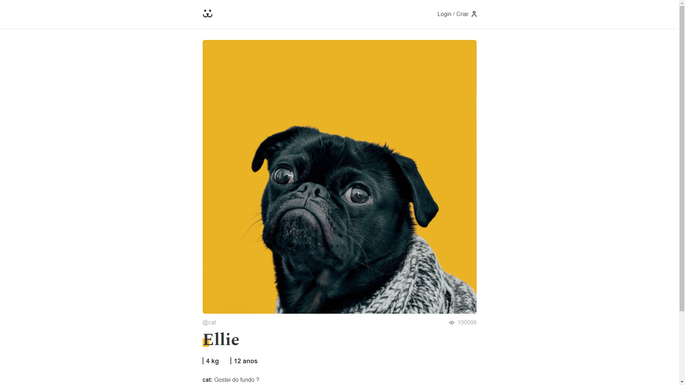
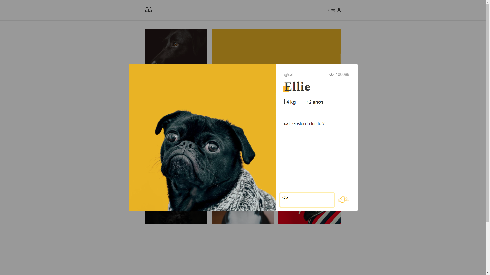
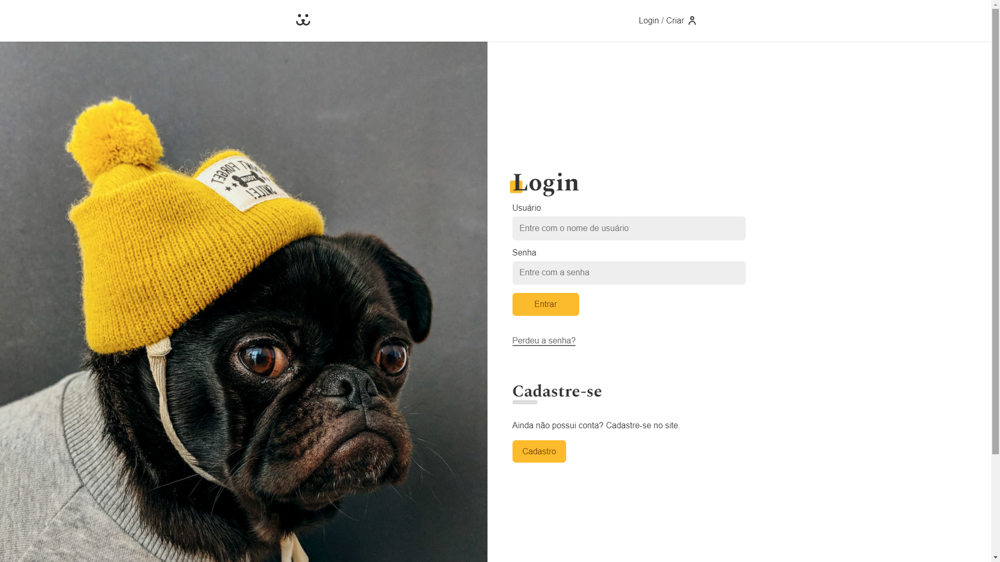
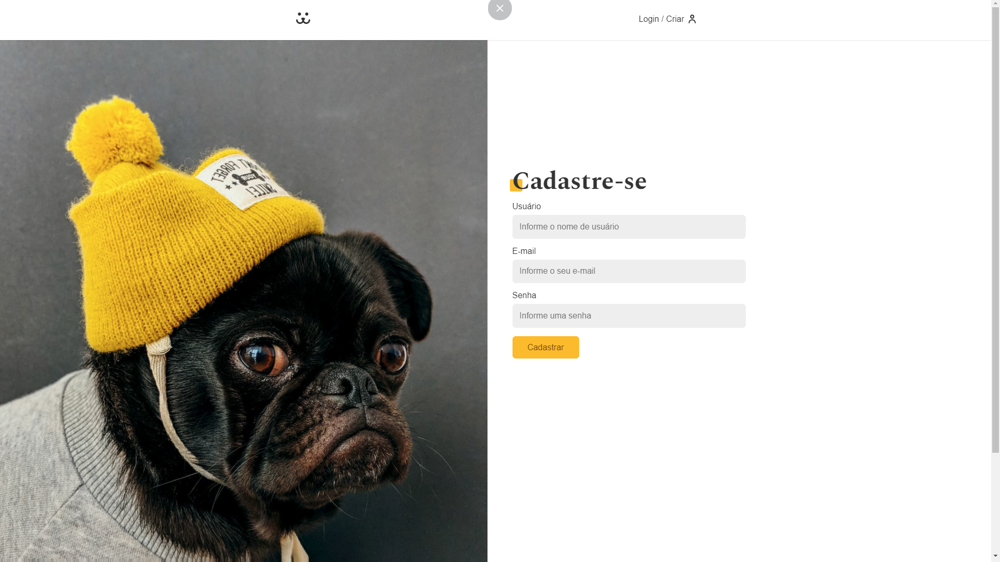
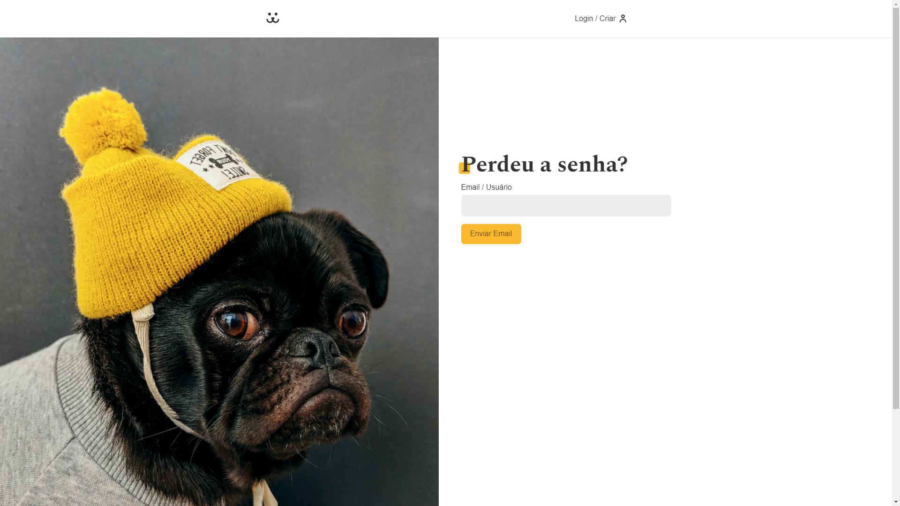
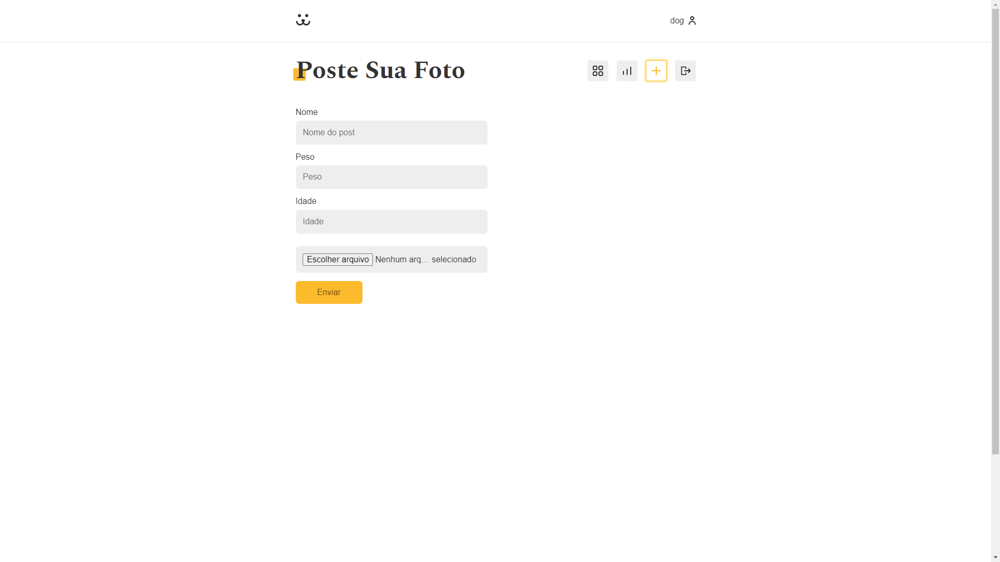

# Dogs
Dogs é um projeto realizado durante o curso de React Completo do professor André Rafael da Origamid.

https://www.origamid.com/curso/react-completo/

Neste curso se aprende-se a como utilizar o React do zero para o desenvolvimento de aplicações web reativas.

Aprende-se a criar um aplicativo web com funcionalidades parecidas de redes sociais como o Instagram.

O foco do curso é no entendimento completo do React, com isso praticamente tudo será criado do zero, sem a dependência de pacotes externos.

Alguns tópicos presentes no curso
- Hooks
- React Router
- useContext
- CSS Modules
- PropTypes
- Componentes Funcionais
- Propriedades
- Eventos

## Algumas Screenshots

### Feed


### Preview


### Detalhe


### Commentários


### Login


### Cadastro


### Recuperar Senha


### Adicionar Foto


# Como executar o projeto
```console
git clone https://github.com/jonasmarco/dogs
yarn install
yarn start
```